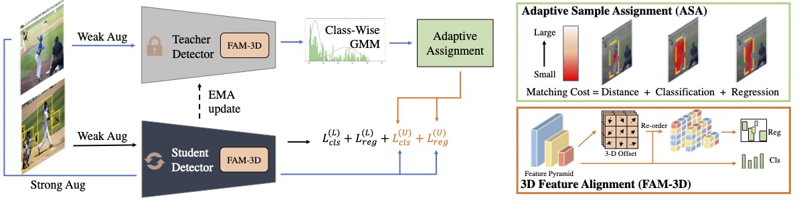

# Consistent-Teacher: Towards Reducing Inconsistent Pseudo-targets in Semi-supervised Object Detection

[](https://paperswithcode.com/sota/semi-supervised-object-detection-on-coco-100?p=consistent-teacher-provides-better-1)
[](https://paperswithcode.com/sota/semi-supervised-object-detection-on-coco-10?p=consistent-teacher-provides-better-1)
[](https://paperswithcode.com/sota/semi-supervised-object-detection-on-coco-2?p=consistent-teacher-provides-better-1)
[](https://paperswithcode.com/sota/semi-supervised-object-detection-on-coco-5?p=consistent-teacher-provides-better-1)
[](https://paperswithcode.com/sota/semi-supervised-object-detection-on-coco-1?p=consistent-teacher-provides-better-1)

This repository contains the offical implementation for our paper

**Consistent-Teacher: Towards Reducing Inconsistent Pseudo-targets in Semi-supervised Object Detection**

[[arxiv](https://arxiv.org/abs/2209.01589)] [[code](https://github.com/Adamdad/ConsistentTeacher)]

Xinjiang Wang*, Xingyi Yang*, Shilong Zhang, Yijiang Li, Litong Feng, Shijie Fang, Chengqi Lyu, Kai Chen, Wayne Zhang 



## Main Results

**MS-COCO 10% Labeled Data**

| Method | mAP| config| 
|---- | ----| ----
| MeanTeacher | 35.50 | [config](configs/baseline/mean_teacher_retinanet_r50_fpn_coco_180k_10p.py)|
| ConsistentTeacher | 40.00 | [config](configs/consistent-teacher/consistent_teacher_r50_fpn_coco_180k_10p.py)|
| ConsistentTeacher 2x8 | 38.00 | [config](configs/consistent-teacher/consistent_teacher_r50_fpn_coco_180k_10p_2x8.py) [wandb](https://wandb.ai/yangxingyi/consistent-teacher/runs/2qoa5ws3) |

**MS-COCO100% Labeled + Unlabeled Data**

| Method | mAP| config| 
|---- | ----| ----
| ConsistentTeacher 5x8 | 47.70 | [config](configs/consistent-teacher/consistent_teacher_r50_fpn_coco_360k_fulldata.py)|

**PASCAL VOC07 Label + VOC12 Unlabel**

| Method | mAP| AP50| config| 
|---- | ----| ---- | ---- |
| MeanTeacher | 53.61 | 77.02 |[config](configs/baseline/mean_teacher_retinanet_r50_fpn_voc0712_72k.py)|
| ConsistentTeacher | 59.00 | 81.00 |  [config](configs/consistent-teacher/consistent_teacher_r50_fpn_voc0712_72k.py)|

## File Orgnizations

```
  configs              
  - baseline
    - mean_teacher_retinanet_r50_fpn_coco_180k_10p.py       
      # Mean Teacher COCO 10% config
    - mean_teacher_retinanet_r50_fpn_voc0712_72k.py      
      # Mean Teacher VOC0712 config

  - consistent-teacher
    - consistent_teacher_r50_fpn_coco_180k_10p.py           
      # Consistent Teacher COCO 10% config
    - consistent_teacher_r50_fpn_voc0712_72k.py             
      # Consistent Teacher VOC0712 config


  ssod
  - models/mean_teacher.py                           
    # Consistent Teacher Class file
  - models/consistent_teacher.py                     
    # Consistent Teacher Class file
  - models/dense_heads/fam3d.py                      
    # FAM-3D Class file
  - models/dense_heads/improved_retinanet.py                      
    #  ImprovedRetinaNet baseline file
  - core/bbox/assigners/dynamic_assigner.py
    # Aadaptive Sample Assignment Class file

  tools
  - dataset/semi_coco.py
    # COCO data preprocessing
  - train.py/test.py
    # Main file for train and evaluate the models

```
### Notes
- Defaultly, all models are trained on 8*V100 GPUs with 5 images per GPU.

## Usage

### Requirements
- `Pytorch=1.9.0`
- `mmdetection=2.25.0`
- `mmcv=1.3.9`
- `wandb=0.10.31`

or 

- `mmdetection=2.28.1`
- `mmcv=1.7.1`

#### Notes
- We use [wandb](https://wandb.ai/) for visualization, if you don't want to use it, just comment line `273-284` in `configs/consistent-teacher/base.py`.

### Installation
Install all the requirements [INSTALL](https://mmdetection.readthedocs.io/en/stable/get_started.html), then git pull the `mmdetecton` repo and ConsistentTeacher under the same folder
```
git clone https://github.com/open-mmlab/mmdetection.git
git clone https://github.com/Adamdad/ConsistentTeacher.git
cd ConsistentTeacher/
```


### Data Preparation
#### COCO Dataset
- Download the COCO dataset
- Execute the following command to generate data set splits:
```shell script
# YOUR_DATA should be a directory contains coco dataset.
# For eg.:
# YOUR_DATA/
#  coco_semi/
#     instances_train2017.${fold}@${percent}.json
#  coco/
#     train2017/
#     val2017/
#     unlabeled2017/
#     annotations/
ln -s ${YOUR_DATA} data
bash tools/dataset/prepare_coco_data.sh conduct

```
For concrete instructions of what should be downloaded, please refer to `tools/dataset/prepare_coco_data.sh` line [`11-24`](https://github.com/microsoft/SoftTeacher/blob/863d90a3aa98615be3d156e7d305a22c2a5075f5/tools/dataset/prepare_coco_data.sh#L11)
### Training

- To train model on the **partial labeled data** and **full labeled data** setting:

```shell script
# CONFIG_FILE_PATH: the config file for experiment.
# GPU_NUM: number of gpus to run the job
bash tools/dist_train.sh <CONFIG_FILE_PATH> <NUM_GPUS>
```
For example, to train ours `R50` model with 8 GPUs:
```shell script
bash tools/dist_train.sh configs/consistent-teacher/consistent_teacher_r50_fpn_coco_180k_10p.py 8
```
- To train model on **new dataset**:

The core idea is to convert a new dataset to coco format. Details about it can be found in the [adding new dataset](https://github.com/open-mmlab/mmdetection/blob/master/docs/tutorials/customize_dataset.md).

#### VOC0712 Dataset
- Download JSON files for unlabeled images PASCAL VOC data in COCO format
```
cd ${DATAROOT}

wget https://storage.cloud.google.com/gresearch/ssl_detection/STAC_JSON.tar
tar -xf STAC_JSON.tar.gz
# voc/VOCdevkit/VOC2007/instances_test.json
# voc/VOCdevkit/VOC2007/instances_trainval.json
# voc/VOCdevkit/VOC2012/instances_trainval.json
```

## Citation

```bibtex
@article{wang2023consistent,
    author    = {Xinjiang Wang, Xingyi Yang, Shilong Zhang, Yijiang Li, Litong Feng, Shijie Fang, Chengqi Lyu, Kai Chen, Wayne Zhang },
    title     = {Consistent-Teacher: Towards Reducing Inconsistent Pseudo-targets in Semi-supervised Object Detection},
    journal   = {arxiv},
    year      = {2023},
}
```